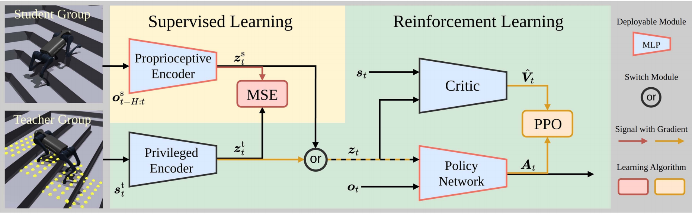

<p align="center">
    
</p>

# bipedal_locomotion_isaaclab

[](https://docs.omniverse.nvidia.com/isaacsim/latest/overview.html)
[](https://isaac-sim.github.io/IsaacLab)
[](https://docs.python.org/3/whatsnew/3.10.html)
[](https://releases.ubuntu.com/20.04/)
[](https://www.microsoft.com/en-us/)
[](https://pre-commit.com/)
[](https://opensource.org/license/mit)

## Overview

This repository is used to train and simulate bipedal robots, such as [limxdynamics TRON1](https://www.limxdynamics.com/en/tron1).
With the help of [Isaac Lab](https://github.com/isaac-sim/IsaacLab), we can train the bipedal robots to walk in different environments, such as flat, rough, and stairs.

**Keywords:** isaaclab, locomotion, bipedal, pointfoot

## Installation

- Install Isaac Lab by following the [installation guide](https://isaac-sim.github.io/IsaacLab/main/source/setup/installation/index.html). We recommend using the conda installation as it simplifies calling Python scripts from the terminal.

- Clone the repository separately from the Isaac Lab installation (i.e. outside the `IsaacLab` directory):

```bash
# Option 1: HTTPS
git clone https://github.com/Andy-xiong6/bipedal_locomotion_isaaclab.git

# Option 2: SSH
git clone git@github.com:Andy-xiong6/bipedal_locomotion_isaaclab.git
```

```bash
# Enter the repository
conda activate isaaclab
cd bipedal_locomotion_isaaclab
```

- Using a python interpreter that has Isaac Lab installed, install the library

```bash
python -m pip install -e exts/bipedal_locomotion
```
## Set up IDE (Optional)

To setup the IDE, please follow these instructions:

- Run VSCode Tasks, by pressing `Ctrl+Shift+P`, selecting `Tasks: Run Task` and running the `setup_python_env` in the drop down menu. When running this task, you will be prompted to add the absolute path to your Isaac Sim installation.

If everything executes correctly, it should create a file .python.env in the `.vscode` directory. The file contains the python paths to all the extensions provided by Isaac Sim and Omniverse. This helps in indexing all the python modules for intelligent suggestions while writing code. 

## Training the bipedal robot agent
- Use the `scripts/rsl_rl/train.py` script to train the robot directly, specifying the task:

```bash
python scripts/rsl_rl/train.py --task=Isaac-PF-Blind-Flat-v0 --headless
```

- It is recommend to use `start.sh` script to train the robot, specifying the task in the script:

```bash
bash ./start.sh
```

- The following arguments can be used to customize the training:
    * --headless: Run the simulation in headless mode
    * --num_envs: Number of parallel environments to run
    * --max_iterations: Maximum number of training iterations
    * --save_interval: Interval to save the model
    * --seed: Seed for the random number generator

## Playing the trained model
- To play a trained model:

```bash
python scripts/rsl_rl/play.py --task=Isaac-PF-Blind-Flat-Play-v0 --checkpoint_path=path/to/checkpoint
```

- The following arguments can be used to customize the playing:
    * --num_envs: Number of parallel environments to run
    * --headless: Run the simulation in headless mode
    * --checkpoint_path: Path to the checkpoint to load

## Running exported model in mujoco (sim2sim)
- After playing the model, the policy has already been saved. You can export the policy to mujoco environment and run it in mujoco [@Andy-xiong6/pointfoot-mujoco-sim](https://github.com/Andy-xiong6/pointfoot-mujoco-sim) by using the `rl-deploy-with-python` repo [@Andy-xiong6/rl-deploy-with-python](https://github.com/Andy-xiong6/rl-deploy-with-python).

- Follwing the instructions to install it properly and replace the `model/pointfoot/{Robot Type}/policy/policy.onnx` by your trained policy.onnx.

## Running exported model in real robot (sim2real)
<p align="center">
    
</p>

Overview of the learning framework. The policies are trained using PPO within an asymmetric actor-critic framework.
Agents in both groups share the same critic and policy network, with actions determined by observations and latent representations from either privileged or proprioceptive encoder. The privileged encoder is trained via policy gradient, while the proprioceptive encoder undergoes supervised learning to minimizereconstruction loss.([H. Wang, H. Luo, W. Zhang, and H. Chen (2024)](https://doi.org/10.1109/LRA.2024.3457379))

## Video Demonstration

### Simulation in Isaac Lab
- **Pointfoot Blind Flat**:

https://github.com/user-attachments/assets/58acb940-adc3-42c2-a249-a0fd8c1fd52c  

- **Pointfoot Blind Rough**:

https://github.com/user-attachments/assets/7448ebe3-0107-49d7-81c7-71df0951bd37

- **Pointfoot Blind Stairs**:

https://github.com/user-attachments/assets/74074571-f327-42d0-a424-7df8d9e96653

### Simulation in Mujoco
- **Pointfoot Blind Flat**:

https://github.com/user-attachments/assets/85a7fff1-53cc-446a-a97f-4e1d909134c2

## Troubleshooting

### Pylance Missing Indexing of Extensions

In some VsCode versions, the indexing of part of the extensions is missing. In this case, add the path to your extension in `.vscode/settings.json` under the key `"python.analysis.extraPaths"`.

```json
{
    "python.analysis.extraPaths": [
        "<path-to-ext-repo>/exts/bipedal_locomotion"
    ]
}
```

### Pylance Crash

If you encounter a crash in `pylance`, it is probable that too many files are indexed and you run out of memory.
A possible solution is to exclude some of omniverse packages that are not used in your project.
To do so, modify `.vscode/settings.json` and comment out packages under the key `"python.analysis.extraPaths"`
Some examples of packages that can likely be excluded are:

```json
"<path-to-isaac-sim>/extscache/omni.anim.*"         // Animation packages
"<path-to-isaac-sim>/extscache/omni.kit.*"          // Kit UI tools
"<path-to-isaac-sim>/extscache/omni.graph.*"        // Graph UI tools
"<path-to-isaac-sim>/extscache/omni.services.*"     // Services tools
...
```

## Acknowledgements

This project uses the following open-source libraries:
- [IsaacLabExtensionTemplate](https://github.com/isaac-sim/IsaacLabExtensionTemplate)
- [rsl_rl](https://github.com/leggedrobotics/rsl_rl/tree/master)

This project is inspired by the work of [H. Wang, H. Luo, W. Zhang, and H. Chen (2024)](https://doi.org/10.1109/LRA.2024.3457379), which laid the groundwork for the idea behind this repository.

This project is part of the **Bipedal Robot Control** project led by Prof. Wei Zhang at **SUSTech** (Southern University of Science and Technology).

Special thanks to all the contributors for their hard work and dedication:
- Prof. Wei Zhang
- Hongwei Xiong
- Haoxiang Luo
- Junde Guo
- Bobin Wang
- Haojia Zhang  

Special thanks to [CLEAR Lab](https://github.com/clearlab-sustech) for their technical and financial support during the development of this project.  

<p align="center">
    
</p>