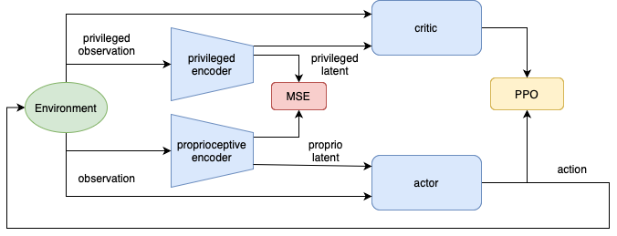

<p align="center">
    
</p>

# Dodo Robot Isaaclab Sim2Real

[](https://docs.isaacsim.omniverse.nvidia.com/4.2.0/index.html)
[](https://isaac-sim.github.io/IsaacLab)
[](https://docs.python.org/3/whatsnew/3.10.html)
[](https://releases.ubuntu.com/20.04/)
[](https://www.microsoft.com/en-us/)
[](https://opensource.org/license/mit)

## Overview
This repository is served as the place to store all the 
related work, codes, attempts and random ideas for the locomotion task in the real work of our customized Dodo robot build in the Dodo Lab in MIRMI TUM. 

In order to build our own robot **Dodo??**, our team member  first designed the robot body in solid work.. then our professionals bought driver control board and motors/actuators only with the specification descripted in \cite{...}.  

To deploy simulation environment, we have to follow the Isaacsim APIs of building scene to convert the robot urdf file into a file of usd format by the Isaacsim urdf importer. 

To train the locomotion policy, we leverage the PPO as our training algorithm with up to 50k simulation environments running in parellel \cite{pic.?} with the help of [Isaac Lab](https://github.com/isaac-sim/IsaacLab). 


**Keywords:** Isaaclab, locomotion, bipedal, customized robot, sim-to-real. 

## Local Installation

- Install Isaacsim by following the [installation guide](https://docs.isaacsim.omniverse.nvidia.com/4.2.0/installation/index.html). We recommend using the conda installation as it simplifies calling Python scripts from the terminal.

- Install Isaac Lab by following the [installation guide](https://isaac-sim.github.io/IsaacLab/main/source/setup/installation/index.html). We recommend using the conda installation as it simplifies calling Python scripts from the terminal.

- Clone the repository separately from the Isaac Lab installation (i.e. outside the `IsaacLab` directory):

```bash
git clone https://github.com/splendidsummer/Dodo_Robot_Sim2Real.git
```

```bash
# Enter the repository
conda activate your_isaaclab_env
cd Dodo_Robot_Sim2Real
```

- Using a python interpreter that has Isaac Lab installed, install the library

```bash
python -m pip install -e exts/dodo_bipedal_locomotion
```
## Set up VSCODE

To setup the VSCODE, please follow these instructions:

- Run VSCode Tasks, by pressing `Ctrl+Shift+P`, selecting `Tasks: Run Task` and running the `setup_python_env` in the drop down menu. When running this task, you will be prompted to add the absolute path to your Isaacsim installation if you are not planning to install Isaacsim with pip installation. 

<!-- If everything executes correctly, it should create a file .python.env in the `.vscode` directory. The file contains the python paths to all the extensions provided by Isaac Sim and Omniverse. This helps in indexing all the python modules for intelligent suggestions while writing code. -->

- Select Python Interpreter, by pressing `Ctrl+Shift+P`, selecting `Python: Select Interpreter` to select your Isaaclab environment. 

## Training the bipedal robot agent
- Use the `scripts/rsl_rl/train.py` script to train the robot directly, specifying the task:

```bash
python scripts/rsl_rl/train.py --task=Isaac-PF-Blind-Flat-v0 --headless
```

- It is recommend to use `start.sh` script to train the robot, specifying the task in the script:

```bash
bash ./start.sh
```

- The following arguments can be used to customize the training:
    * --headless: Run the simulation in headless mode
    * --num_envs: Number of parallel environments to run
    * --max_iterations: Maximum number of training iterations
    * --save_interval: Interval to save the model
    * --seed: Seed for the random number generator

## Playing the trained model
- To play a trained model:

```bash
python scripts/rsl_rl/play.py --task=Isaac-PF-Blind-Flat-Play-v0 --checkpoint_path=path/to/checkpoint
```

- The following arguments can be used to customize the playing:
    * --num_envs: Number of parallel environments to run
    * --headless: Run the simulation in headless mode
    * --checkpoint_path: Path to the checkpoint to load

## Running exported model in mujoco (sim2sim)
- After playing the model, the policy has already been saved. You can export the policy to mujoco environment and run it in mujoco [@Andy-xiong6/pointfoot-mujoco-sim](https://github.com/Andy-xiong6/pointfoot-mujoco-sim) by using the [@Andy-xiong6/rl-deploy-with-python](https://github.com/Andy-xiong6/rl-deploy-with-python).

- Following the instructions to install it properly and replace the `model/pointfoot/{Robot Type}/policy/policy.onnx` by your trained policy.onnx.

## Running exported model in real robot (sim2real)
<p align="center">
    
</p>

**Overview of the learning framework.**

- The policies are trained using PPO within an asymmetric actor-critic framework, with actions determined by observations and latent representations from either privileged or proprioceptive encoder. There are two encoders. The privileged encoder is trained via policy gradient, while the proprioceptive encoder undergoes supervised learning to minimize reconstruction loss. **Inspired by the paper CTS: Concurrent Teacher-Student Reinforcement Learning for Legged Locomotion. ([H. Wang, H. Luo, W. Zhang, and H. Chen (2024)](https://doi.org/10.1109/LRA.2024.3457379))**

- Using the [`rl-deploy-with-python` repo `mlp` branch](https://github.com/Andy-xiong6/rl-deploy-with-python/tree/mlp) to deploy the trained policy to the real robot.

Still in progress...

## Video Demonstration

### Simulation in Isaac Lab
- **Blind Flat**:

https://github.com/user-attachments/assets/58acb940-adc3-42c2-a249-a0fd8c1fd52c

- **Blind Rough**:

https://github.com/user-attachments/assets/7448ebe3-0107-49d7-81c7-71df0951bd37

- **Blind Stairs**:

https://github.com/user-attachments/assets/74074571-f327-42d0-a424-7df8d9e96653


### Deployment in Real Robot
- **Pointfoot Blind Flat**:


## Troubleshooting

### Problem 1


### Problem 2


```json
# code example lines 
"<path-to-isaac-sim>/extscache/omni.anim.*"         // Animation packages
...
```

## Acknowledgements

This project uses the following open-source libraries:
- [IsaacLabExtensionTemplate](https://github.com/isaac-sim/IsaacLabExtensionTemplate)
- [rsl_rl](https://github.com/leggedrobotics/rsl_rl/tree/master)
- [bipedal_locomotion_isaaclab](https://github.com/Andy-xiong6/bipedal_locomotion_isaaclab.git) 

This project is inspired by the work of [H. Wang, H. Luo, W. Zhang, and H. Chen (2024)](https://doi.org/10.1109/LRA.2024.3457379), which laid the groundwork for the idea behind this repository.

**Contributors:**
- Shanshan Zhang
- Dian Yu 
- Zerui Wang
- Jiahe Mao
- ??? Yuan

